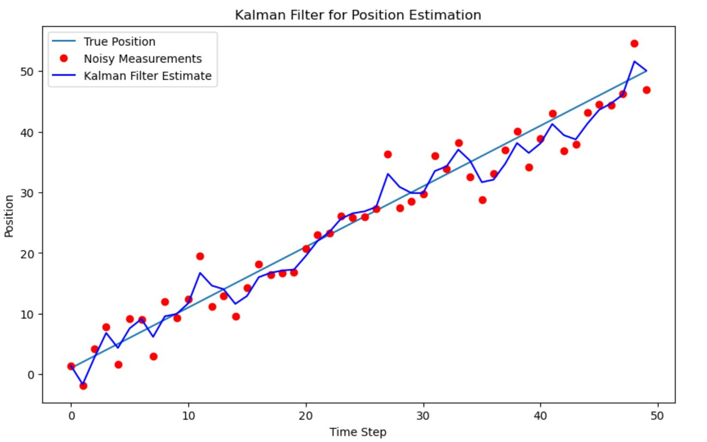

# Kalman Filters in State Estimation Implementation

---

## 문제 설정 (Problem Setup)

물체의 **위치(position)** 와 **속도(velocity)** 를 추정하는 칼만 필터 구현이다.

```
상태 벡터: xₖ = [positionₖ]
                [velocityₖ]
```

| 항목 | 내용 |
|------|------|
| **측정값** | 노이즈가 포함된 물체의 위치만 관측 |
| **상태 전이 모델** | 일정한 속도로 이동 가정: xₖ = Fₖ xₖ₋₁ + wₖ₋₁ |
| **측정 모델** | 위치만 관측: zₖ = Hₖ xₖ + vₖ |

- **Fₖ:** 상태 전이 행렬 / **wₖ₋₁:** 프로세스 노이즈
- **Hₖ:** 관측 행렬 / **vₖ:** 측정 노이즈

---

## 코드 구조 전체 흐름

```
초기 설정 (F, H, Q, R, x, P)
         │
         ▼
실제 위치 시뮬레이션 + 노이즈 측정값 생성
         │
         ▼
  ┌── 칼만 필터 반복 (n=50회) ──┐
  │                              │
  │  1. 예측 단계                │
  │     x̂ = F·x̂                │
  │     P = F·P·Fᵀ + Q          │
  │                              │
  │  2. 업데이트 단계            │
  │     y = z - H·x̂  (혁신)    │
  │     S = H·P·Hᵀ + R          │
  │     K = P·Hᵀ·S⁻¹ (이득)    │
  │     x̂ = x̂ + K·y            │
  │     P = (I - K·H)·P         │
  └──────────────────────────────┘
         │
         ▼
결과 그래프 출력
```

---

## 1단계: 초기 설정

```python
import numpy as np
import matplotlib.pyplot as plt

dt = 1.0  # 시간 간격
```

### 행렬 정의

```python
# 상태 전이 행렬 (일정 속도 모델)
# 새 위치 = 이전 위치 + 속도 × 시간 / 속도는 변하지 않음
F = np.array([[1, dt],
              [0,  1]])

# 관측 행렬 (위치만 측정, 속도는 무시)
H = np.array([[1, 0]])

# 프로세스 노이즈 공분산 (모델 예측의 불확실성)
Q = np.array([[1, 0],
              [0, 1]])

# 측정 노이즈 공분산 (측정의 불확실성)
R = np.array([[10]])
```

### 초기 상태

```python
x = np.array([[0],   # 초기 위치: 0
              [1]])  # 초기 속도: 1

# 초기 공분산 — 500으로 설정 (초기 불확실성이 매우 큼)
P = np.array([[500, 0],
              [0, 500]])

n = 50  # 시간 단계 수
```

---

## 2단계: 시뮬레이션 데이터 생성

```python
true_positions = []   # 실제 위치
measurements = []     # 노이즈 측정값
position = 0
velocity = 1

for i in range(n):
    # 실제 위치 (노이즈 없음)
    position += velocity * dt
    true_positions.append(position)

    # 노이즈 측정값: 평균 0, 표준편차 √10 인 가우스 노이즈 추가
    noisy_measurement = position + np.random.normal(0, np.sqrt(R[0, 0]))
    measurements.append(noisy_measurement)
```

---

## 3단계: 칼만 필터 실행

```python
estimates = []

for i in range(n):

    # ── 예측 단계 ─────────────────────────────────────
    x = np.dot(F, x)                    # 상태 예측: x̂ₖ|ₖ₋₁ = F · x̂ₖ₋₁|ₖ₋₁
    P = np.dot(np.dot(F, P), F.T) + Q  # 공분산 예측: Pₖ|ₖ₋₁ = F·P·Fᵀ + Q

    # ── 업데이트 단계 ──────────────────────────────────
    z = np.array([[measurements[i]]])        # 현재 측정값

    y = z - np.dot(H, x)                    # 혁신(잔차): yₖ = zₖ - H·x̂
    S = np.dot(H, np.dot(P, H.T)) + R       # 혁신 공분산: Sₖ = H·P·Hᵀ + R
    K = np.dot(np.dot(P, H.T),
               np.linalg.inv(S))            # 칼만 이득: Kₖ = P·Hᵀ·Sₖ⁻¹

    x = x + np.dot(K, y)                    # 상태 업데이트: x̂ₖ|ₖ = x̂ + K·y
    P = np.dot(np.eye(2) - np.dot(K, H), P) # 공분산 업데이트: Pₖ|ₖ = (I-K·H)·P

    estimates.append(x[0, 0])               # 추정 위치 저장
```

---

## 4단계: 결과 시각화

```python
plt.figure(figsize=(10, 6))
plt.plot(true_positions, label='True Position')           # 실제 위치 (선)
plt.plot(measurements, 'ro', label='Noisy Measurements')  # 노이즈 측정값 (빨간 점)
plt.plot(estimates, 'b-', label='Kalman Filter Estimate') # 칼만 추정값 (파란 선)
plt.legend()
plt.xlabel('Time Step')   # x축: 시간 단계
plt.ylabel('Position')    # y축: 위치
plt.title('Kalman Filter for Position Estimation')
plt.show()
```

### 그래프 결과



### 그래프 해석

| 선/점 | 의미 |
|-------|------|
| **하늘색 실선 (True Position)** | 노이즈 없는 실제 위치 |
| **빨간 점 (Noisy Measurements)** | 노이즈가 포함된 측정값 |
| **파란 선 (Kalman Filter Estimate)** | 칼만 필터가 추정한 위치 |

---

## 핵심 수식 정리

### 예측 단계
| 수식 | 의미 |
|------|------|
| `x̂ₖ|ₖ₋₁ = F · x̂ₖ₋₁|ₖ₋₁` | 이전 상태로부터 현재 상태 예측 |
| `Pₖ|ₖ₋₁ = F·P·Fᵀ + Q` | 불확실성(공분산) 예측 |

### 업데이트 단계
| 수식 | 의미 |
|------|------|
| `yₖ = zₖ - H·x̂ₖ|ₖ₋₁` | 혁신: 실제 측정값과 예측값의 차이 |
| `Sₖ = H·P·Hᵀ + R` | 혁신 공분산 |
| `Kₖ = P·Hᵀ·Sₖ⁻¹` | 칼만 이득: 예측과 측정의 신뢰도 균형 |
| `x̂ₖ|ₖ = x̂ₖ|ₖ₋₁ + Kₖ·yₖ` | 상태 업데이트 |
| `Pₖ|ₖ = (I - Kₖ·Hₖ)·Pₖ|ₖ₋₁` | 공분산 업데이트 |

---

## 핵심 포인트

> 칼만 필터는 **노이즈가 많은 측정값(빨간 점)** 과 **모델 예측** 을 최적으로 결합하여,
> **실제 위치에 가까운 부드러운 추정값(파란 선)** 을 만들어낸다.

- 초기 공분산 P=500 → 불확실성이 크므로 초반에는 측정값을 더 신뢰
- 반복할수록 P가 줄어들며 → 예측값의 신뢰도가 높아짐
- 칼만 이득 K가 예측과 측정 사이의 **균형을 자동으로 조절**

---

*AI for Autonomous Vehicles and Robotics 강좌 정리*
