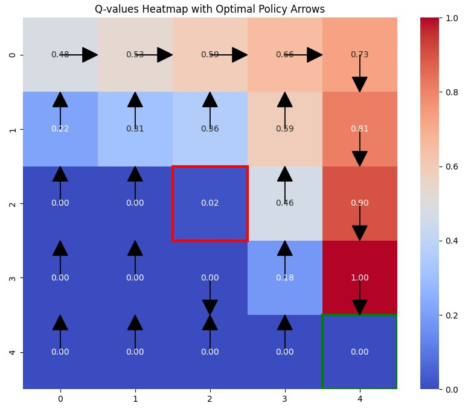

# Reinforcement Learning (Q-table): Programming Exercise
## Gridworld Q-Learning — 전체 코드 분석

---

## 📌 코드 구조 개요

```
환경 정의 (Grid, 보상, 행동)
        │
        ▼
Q-테이블 초기화
        │
        ▼
하이퍼파라미터 설정 (α, γ, ε)
        │
        ▼
보조 함수 정의
  ├── get_next_state()   → 다음 상태 계산
  └── choose_action()    → ε-탐욕 행동 선택
        │
        ▼
Q-러닝 학습 루프 (500 에피소드)
        │
        ▼
결과 시각화 (히트맵 + 정책 화살표)
```

---

## 1. 환경 정의 (Environment Setup)

```python
import numpy as np
import matplotlib.pyplot as plt
import seaborn as sns
import random

grid_size = 5
goal_state     = (4, 4)   # 목표: 우하단
obstacle_state = (2, 2)   # 장애물: 중앙
start_state    = (0, 0)   # 시작: 좌상단
```

### 보상 행렬 (Reward Matrix)

```python
rewards = np.zeros((grid_size, grid_size))  # 기본값: 0
rewards[goal_state]     =  1   # 목표 도달: +1
rewards[obstacle_state] = -1   # 장애물 충돌: -1
```

```
보상 행렬 시각화:
  0    0    0    0    0
  0    0    0    0    0
  0    0   -1    0    0   ← 장애물 (2,2)
  0    0    0    0    0
  0    0    0    0   +1   ← 목표 (4,4)
```

> **설계 포인트:** 빈 공간의 보상을 0으로 설정하면 에이전트가
> 불필요한 이동을 줄이고 최단 경로를 자연스럽게 학습하게 된다.

---

### 행동 정의 (Action Space)

```python
actions = ['up', 'down', 'left', 'right']

# 행동 → 좌표 변화량
action_mapping = {
    'up'   : (-1,  0),
    'down' : ( 1,  0),
    'left' : ( 0, -1),
    'right': ( 0,  1)
}

# 행동 → 화살표 방향 (시각화용)
action_arrows = {
    'up'   : ( 0,  0.3),
    'down' : ( 0, -0.3),
    'left' : (-0.3,  0),
    'right': ( 0.3,  0)
}
```

| 행동 | 좌표 변화 | 의미 |
|------|-----------|------|
| up | (-1, 0) | 행(row) 감소 → 위로 이동 |
| down | (+1, 0) | 행(row) 증가 → 아래로 이동 |
| left | (0, -1) | 열(col) 감소 → 왼쪽으로 이동 |
| right | (0, +1) | 열(col) 증가 → 오른쪽으로 이동 |

---

## 2. Q-테이블 초기화 (Q-table Initialization)

```python
Q_values = np.zeros((grid_size, grid_size, len(actions)))
# 형태: (5, 5, 4) → 총 100개의 Q-값
# 초기값: 모두 0
```

```
Q-테이블 구조:
  Q_values[row][col][action]
                    ├── 0: up
                    ├── 1: down
                    ├── 2: left
                    └── 3: right
```

> **왜 0으로 초기화하는가?**
> Q-러닝은 낙관적(optimistic) 초기화도 가능하지만,
> 0 초기화는 중립적 출발점을 제공하여 탐색을 자연스럽게 유도한다.

---

## 3. 하이퍼파라미터 (Hyperparameters)

```python
alpha   = 0.1   # 학습률 (Learning Rate)
gamma   = 0.9   # 할인 계수 (Discount Factor)
epsilon = 0.1   # 탐색률 (Exploration Rate)
episodes = 500  # 에피소드 수
```

| 파라미터 | 값 | 역할 | 영향 |
|----------|-----|------|------|
| **α (alpha)** | 0.1 | 새 정보 반영 비율 | 크면 빠르게 학습, 작으면 안정적 수렴 |
| **γ (gamma)** | 0.9 | 미래 보상 중요도 | 1에 가까울수록 장기 보상 중시 |
| **ε (epsilon)** | 0.1 | 무작위 행동 확률 | 크면 탐색 위주, 작으면 활용 위주 |
| **episodes** | 500 | 총 학습 횟수 | 많을수록 안정적 정책 수렴 |

> **하이퍼파라미터 튜닝은 경험과 실험의 영역이다.**
> α=0.1, γ=0.9는 간단한 그리드 환경에서 매우 안정적인 조합이다.
> 실제 로봇·자율주행 시스템에서는 이 값들을 환경에 맞게 세밀하게 조정해야 한다.

---

## 4. 보조 함수 (Helper Functions)

### 4-1) 다음 상태 계산 `get_next_state()`

```python
def get_next_state(state, action):
    delta = action_mapping[action]
    next_state = (state[0] + delta[0], state[1] + delta[1])
    
    # 그리드 경계 처리 (벗어나면 제자리)
    next_state = (max(0, min(grid_size - 1, next_state[0])),
                  max(0, min(grid_size - 1, next_state[1])))
    return next_state
```

**경계 처리 로직:**
```
next_state = max(0, min(4, next_state))
  → 0 미만이면 0으로 고정 (그리드 상단/좌측 벽)
  → 4 초과면 4로 고정 (그리드 하단/우측 벽)
```

> **중요 설계 결정:** 벽에 부딪히면 제자리에 머무르도록 설계했다.
> 이렇게 하면 에이전트가 벽 충돌로 인한 추가 패널티 없이 학습할 수 있다.

---

### 4-2) 행동 선택 `choose_action()` — ε-탐욕 전략

```python
def choose_action(state):
    if random.uniform(0, 1) < epsilon:
        # 탐색 (Exploration): 무작위 행동
        return random.choice(actions)
    else:
        # 활용 (Exploitation): 최고 Q-값 행동
        state_Q_values = Q_values[state[0], state[1], :]
        return actions[np.argmax(state_Q_values)]
```

```
random.uniform(0,1) 생성
        │
        ├── < ε (0.1) → 탐색: 4가지 행동 중 무작위 선택 (10%)
        │
        └── ≥ ε (0.1) → 활용: Q-값 최대 행동 선택 (90%)
```

> **ε=0.1의 의미:** 학습의 90%는 지금까지 배운 것을 활용하고,
> 10%는 새로운 가능성을 탐색한다.
> 이 비율은 500 에피소드의 이 환경에서 충분히 수렴한다.

---

## 5. Q-러닝 학습 루프 (Q-Learning Training Loop)

```python
for episode in range(episodes):           # 500번 에피소드 반복
    state = start_state                   # 매 에피소드 시작: (0,0)으로 리셋
    
    while state != goal_state:            # 목표 도달까지 반복
        action = choose_action(state)              # ① 행동 선택
        next_state = get_next_state(state, action) # ② 다음 상태 계산
        reward = rewards[next_state]               # ③ 보상 수령
        
        # ④ Q-러닝 업데이트
        current_q_value  = Q_values[state[0], state[1], actions.index(action)]
        max_future_q_value = np.max(Q_values[next_state[0], next_state[1], :])
        
        new_q_value = current_q_value + alpha * (
            reward + gamma * max_future_q_value - current_q_value
        )
        Q_values[state[0], state[1], actions.index(action)] = new_q_value
        
        state = next_state                         # ⑤ 상태 전이
```

### Q-값 업데이트 수식 분해

```
new_q = current_q + α × (r + γ × max Q(s') - current_q)
                         └───────────────────┘
                              TD 오차 (TD Error)
                         = 실제 가치 - 예측 가치
```

| 항목 | 코드 변수 | 수학 기호 | 설명 |
|------|-----------|-----------|------|
| 현재 Q-값 | `current_q_value` | Q(s,a) | 업데이트 전 추정값 |
| 즉각 보상 | `reward` | r | 다음 상태에서 받는 보상 |
| 미래 최대 Q | `max_future_q_value` | max Q(s',a') | 다음 상태의 최선 가치 |
| TD 오차 | `reward + γ*max_Q - current_q` | δ | 예측 오차 → 학습 신호 |
| 새 Q-값 | `new_q_value` | Q(s,a) ← | 업데이트된 추정값 |

> **TD 오차(δ)가 핵심이다.**
> δ > 0 이면 현재 추정값이 너무 낮았던 것 → Q-값 증가
> δ < 0 이면 현재 추정값이 너무 높았던 것 → Q-값 감소
> δ = 0 이면 완벽한 추정 → 수렴 완료

---

## 6. 시각화 (Visualization)

```python
fig, ax = plt.subplots(figsize=(10, 8))

# 각 상태의 최대 Q-값 추출
state_values = np.max(Q_values, axis=2)  # shape: (5, 5)

# 히트맵 생성
sns.heatmap(state_values, annot=True, cmap='coolwarm',
            cbar=True, fmt=".2f", ax=ax)

# 목표(녹색)와 장애물(빨간색) 테두리 강조
ax.add_patch(plt.Rectangle(goal_state,     1, 1, fill=False, edgecolor='green', lw=3))
ax.add_patch(plt.Rectangle(obstacle_state, 1, 1, fill=False, edgecolor='red',   lw=3))

# 최적 정책 화살표 추가
for i in range(grid_size):
    for j in range(grid_size):
        if (i, j) != goal_state and (i, j) != obstacle_state:
            best_action_idx = np.argmax(Q_values[i, j, :])
            best_action = actions[best_action_idx]
            arrow = action_arrows[best_action]
            ax.arrow(j + 0.5, i + 0.5, arrow[0], -arrow[1],
                     head_width=0.2, head_length=0.2, fc='black', ec='black')

plt.title('Q-values Heatmap with Optimal Policy Arrows')
plt.show()
```

### 시각화 구성 요소

| 요소 | 구현 방법 | 의미 |
|------|-----------|------|
| **히트맵 색상** | `cmap='coolwarm'` | 빨강=높은 가치 / 파랑=낮은 가치 |
| **숫자 표시** | `annot=True, fmt=".2f"` | 각 셀의 최대 Q-값 |
| **녹색 테두리** | `edgecolor='green'` | 목표 상태 (4,4) 표시 |
| **빨간 테두리** | `edgecolor='red'` | 장애물 상태 (2,2) 표시 |
| **화살표** | `ax.arrow()` | 각 상태의 최적 행동 방향 |

### 출력 결과



### 결과 해석

```
색상 분포:
  빨간색 (높은 Q-값) → 목표에 가까운 상태 (우하단)
  파란색 (낮은 Q-값) → 목표와 먼 상태, 장애물 근처 (좌상단, 중앙)

화살표 방향:
  목표를 향해 수렴하는 경로를 자연스럽게 형성
  장애물(2,2) 주변은 우회하는 방향으로 학습됨
```

---

## 7. 전체 코드 핵심 요약

```python
# ── 핵심 설정 ─────────────────────────────
grid_size = 5
Q_values  = np.zeros((5, 5, 4))   # Q-테이블
alpha, gamma, epsilon = 0.1, 0.9, 0.1

# ── 학습 ──────────────────────────────────
for episode in range(500):
    state = (0, 0)
    while state != (4, 4):
        action     = choose_action(state)       # ε-탐욕 선택
        next_state = get_next_state(state, action)
        reward     = rewards[next_state]

        # Q-러닝 업데이트
        Q[s,a] += α * (r + γ * max(Q[s']) - Q[s,a])

        state = next_state

# ── 시각화 ────────────────────────────────
state_values = np.max(Q_values, axis=2)  # 최대 Q-값 추출
sns.heatmap(state_values)                # 히트맵
ax.arrow(...)                            # 정책 화살표
```

---

## 8. 실제 응용으로의 확장

| 이 코드의 한계 | 해결 방법 |
|----------------|-----------|
| 5×5 소규모 환경만 가능 | DQN으로 확장 (신경망이 Q-테이블 대체) |
| 이산적 행동만 지원 | 연속 행동 공간: DDPG, PPO 알고리즘 |
| 단일 에이전트 | 다중 에이전트 RL (Multi-Agent RL) |
| 정적 환경 | 동적 환경 대응: 온라인 학습 추가 |

> **이 코드는 강화학습의 완벽한 출발점이다.**
> Q-테이블 → DQN → PPO → 실제 로봇/자율주행 시스템으로 이어지는
> 강화학습 발전의 핵심 개념이 모두 이 코드 안에 담겨 있다.

---

*AI for Autonomous Vehicles and Robotics 강좌 정리*
